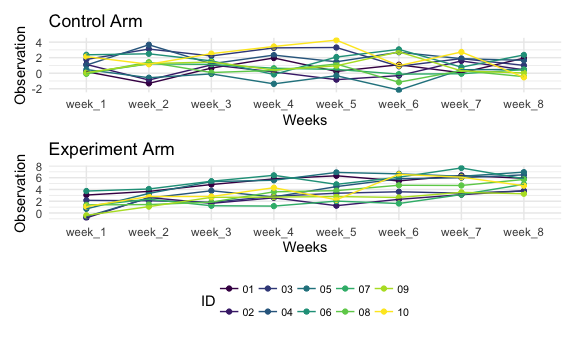

P8105 Homework 5 - Tanya Butt (thb2114)
================

## Problem 1

``` r
homicide_df = 
  read_csv("homicide-data.csv", na = c("","Unknown")) %>% 
  mutate(
    city_state = str_c(city, state),
    resolution = case_when(
      disposition == "Closed without arrest" ~ "unsolved",
      disposition == "Open/No arrest" ~ "unsolved",
      disposition == "Closed by arrest" ~ "solved"
    )) %>% 
    relocate(city_state) %>% 
  filter(city_state != "TulsaAL")
```

    ## Rows: 52179 Columns: 12

    ## ── Column specification ────────────────────────────────────────────────────────
    ## Delimiter: ","
    ## chr (8): uid, victim_last, victim_first, victim_race, victim_sex, city, stat...
    ## dbl (4): reported_date, victim_age, lat, lon

    ## 
    ## ℹ Use `spec()` to retrieve the full column specification for this data.
    ## ℹ Specify the column types or set `show_col_types = FALSE` to quiet this message.

Let’s focus on Baltimore, MD.

``` r
baltimore_df =
  homicide_df %>% 
  filter(city_state == "BaltimoreMD")

baltimore_summary =
  baltimore_df %>% 
  summarize(
    unsolved = sum(resolution == "unsolved"),
    n = n()
  )

baltimore_test = 
  prop.test(
    x = baltimore_summary %>%  pull(unsolved), 
    n = baltimore_summary %>%  pull(n))

baltimore_test %>% 
  broom::tidy()
## # A tibble: 1 × 8
##   estimate statistic  p.value parameter conf.low conf.high method    alternative
##      <dbl>     <dbl>    <dbl>     <int>    <dbl>     <dbl> <chr>     <chr>      
## 1    0.646      239. 6.46e-54         1    0.628     0.663 1-sample… two.sided
```

Let’s try to iterate across cities!

First off, write a function.

``` r
prop_test_function = function(city_df) {
 
   city_summary =
     city_df %>% 
  summarize(
    unsolved = sum(resolution == "unsolved"),
    n = n()
  )

  city_test = 
    prop.test(
      x = city_summary %>%  pull(unsolved), 
      n = city_summary %>%  pull(n))

return(city_test)

}

prop_test_function(baltimore_df)
## 
##  1-sample proportions test with continuity correction
## 
## data:  city_summary %>% pull(unsolved) out of city_summary %>% pull(n), null probability 0.5
## X-squared = 239.01, df = 1, p-value < 2.2e-16
## alternative hypothesis: true p is not equal to 0.5
## 95 percent confidence interval:
##  0.6275625 0.6631599
## sample estimates:
##         p 
## 0.6455607

homicide_df %>% 
  filter(city_state == "AlbuquerqueNM") %>% 
  prop_test_function()
## 
##  1-sample proportions test with continuity correction
## 
## data:  city_summary %>% pull(unsolved) out of city_summary %>% pull(n), null probability 0.5
## X-squared = 19.114, df = 1, p-value = 1.232e-05
## alternative hypothesis: true p is not equal to 0.5
## 95 percent confidence interval:
##  0.3372604 0.4375766
## sample estimates:
##         p 
## 0.3862434
```

Now, let’s iterate across all cities.

``` r
results_df = 
  homicide_df %>% 
  nest(data = uid:resolution) %>% 
  mutate(
    test_results = map(data, prop_test_function),
    tidy_results = map(test_results, broom::tidy)
  ) %>% 
  select(city_state, tidy_results) %>% 
  unnest(tidy_results) %>% 
  select(city_state, estimate, starts_with("conf"))
```

Try to make a plot showing estimates and confidence intervals.

``` r
results_df %>% 
  mutate(city_state = fct_reorder(city_state, estimate)) %>% 
  ggplot(aes(x = city_state, y = estimate )) +
  geom_point() +
  geom_errorbar(aes(ymin = conf.low, ymax = conf.high)) +
  theme(axis.text.x = element_text(angle = 90, vjust = 0.5, hjust = 1))
```


## Problem 2

I will first load in the data and tidy the result.

``` r
problem2_df = 
  tibble(
    files = list.files("./data/")
   )

read_data <- function(file_name) {
  read_csv(paste0("./data/", file_name))
}

study_data =
  problem2_df %>%
  mutate(
    individual_data = map(files, read_data)) %>% 
  unnest(individual_data) %>%
  separate(
    files, c("experiment_arm", "ID"), "_") %>% 
  mutate(
    ID = gsub(".csv","",ID)) %>% 
  mutate(
    ID = as.character(ID)
  ) %>% 
  pivot_longer(
    week_1:week_8,
    names_to = "weeks",
    values_to = "observation") %>% 
  mutate(
    weeks = as.factor(weeks),
    experiment_arm = as.factor(experiment_arm),
    ID = as.factor(ID)
  )
```

I will now create a spaghetti plot showing observations on each subject
over time by experiment arm.

``` r
control_df =  
  filter(study_data, experiment_arm == "con") %>% 
ggplot( 
 aes(x = weeks, y = observation, color = ID,)) +
  geom_point(aes(group = ID)) +
  geom_line(aes(group = ID)) +
  theme(legend.position = 'none') +
   xlab("Weeks") + ylab("Observation") +
  labs(
    title = "Control Arm")

exp_df =  
  filter(study_data, experiment_arm == "exp") %>% 
ggplot( 
  aes(x = weeks, y = observation, color = ID)) +
  geom_point(aes(group = ID)) +
  geom_line(aes(group = ID)) +
  theme(legend.text = element_text(size = 8), legend.spacing.x = unit(0.05, 'cm'),
        legend.position = 'bottom') +
   xlab("Weeks") + ylab("Observation") +
   scale_colour_discrete(name = "ID") +
  labs(
    title = "Experiment Arm")

control_df/exp_df
```



It looks like the weekly observations for subjects in the control arm
did not increase as much and as consistently as the observations for
subjects in the experiment arm.

## Problem 3

``` r
set.seed(10)

iris_with_missing = iris %>% 
  map_df(~replace(.x, sample(1:150, 20), NA)) %>%
  mutate(Species = as.character(Species)) %>% 
  janitor::clean_names()

missing = function(x){
  
  if (is.character(x)) {
    x[is.na(x)] <- "virginica"
  return(x)
}
  if (!is.character(x)) {
    x[is.na(x)] <- mean(x, na.rm = TRUE)
  return(x)
}
  x[is.na(x)] <- mean(x, na.rm = TRUE)
  return(x)
}

missing(iris_with_missing$species) 
##   [1] "setosa"     "setosa"     "setosa"     "setosa"     "setosa"    
##   [6] "setosa"     "setosa"     "setosa"     "setosa"     "setosa"    
##  [11] "setosa"     "setosa"     "setosa"     "setosa"     "setosa"    
##  [16] "setosa"     "setosa"     "setosa"     "setosa"     "setosa"    
##  [21] "setosa"     "virginica"  "setosa"     "setosa"     "virginica" 
##  [26] "setosa"     "virginica"  "setosa"     "setosa"     "setosa"    
##  [31] "setosa"     "setosa"     "setosa"     "setosa"     "setosa"    
##  [36] "setosa"     "setosa"     "setosa"     "setosa"     "setosa"    
##  [41] "setosa"     "virginica"  "setosa"     "setosa"     "setosa"    
##  [46] "virginica"  "setosa"     "setosa"     "setosa"     "setosa"    
##  [51] "virginica"  "versicolor" "versicolor" "versicolor" "versicolor"
##  [56] "versicolor" "virginica"  "versicolor" "virginica"  "versicolor"
##  [61] "versicolor" "versicolor" "versicolor" "versicolor" "versicolor"
##  [66] "versicolor" "versicolor" "versicolor" "versicolor" "versicolor"
##  [71] "versicolor" "virginica"  "versicolor" "versicolor" "versicolor"
##  [76] "versicolor" "versicolor" "versicolor" "versicolor" "virginica" 
##  [81] "versicolor" "versicolor" "versicolor" "versicolor" "versicolor"
##  [86] "versicolor" "versicolor" "versicolor" "versicolor" "versicolor"
##  [91] "versicolor" "versicolor" "versicolor" "virginica"  "versicolor"
##  [96] "versicolor" "versicolor" "versicolor" "versicolor" "virginica" 
## [101] "virginica"  "virginica"  "virginica"  "virginica"  "virginica" 
## [106] "virginica"  "virginica"  "virginica"  "virginica"  "virginica" 
## [111] "virginica"  "virginica"  "virginica"  "virginica"  "virginica" 
## [116] "virginica"  "virginica"  "virginica"  "virginica"  "virginica" 
## [121] "virginica"  "virginica"  "virginica"  "virginica"  "virginica" 
## [126] "virginica"  "virginica"  "virginica"  "virginica"  "virginica" 
## [131] "virginica"  "virginica"  "virginica"  "virginica"  "virginica" 
## [136] "virginica"  "virginica"  "virginica"  "virginica"  "virginica" 
## [141] "virginica"  "virginica"  "virginica"  "virginica"  "virginica" 
## [146] "virginica"  "virginica"  "virginica"  "virginica"  "virginica"
missing(iris_with_missing$sepal_length) 
##   [1] 5.100000 4.900000 4.700000 4.600000 5.000000 5.400000 5.819231 5.000000
##   [9] 4.400000 4.900000 5.400000 4.800000 5.819231 4.300000 5.819231 5.700000
##  [17] 5.400000 5.100000 5.700000 5.100000 5.400000 5.100000 4.600000 5.819231
##  [25] 4.800000 5.000000 5.000000 5.200000 5.819231 4.700000 4.800000 5.400000
##  [33] 5.200000 5.500000 4.900000 5.000000 5.500000 4.900000 4.400000 5.100000
##  [41] 5.000000 4.500000 4.400000 5.000000 5.100000 4.800000 5.100000 4.600000
##  [49] 5.300000 5.000000 7.000000 6.400000 6.900000 5.500000 6.500000 5.700000
##  [57] 6.300000 4.900000 6.600000 5.200000 5.000000 5.900000 6.000000 6.100000
##  [65] 5.600000 6.700000 5.600000 5.800000 6.200000 5.600000 5.900000 5.819231
##  [73] 6.300000 5.819231 6.400000 6.600000 6.800000 6.700000 6.000000 5.700000
##  [81] 5.500000 5.819231 5.800000 6.000000 5.400000 5.819231 6.700000 5.819231
##  [89] 5.600000 5.500000 5.500000 5.819231 5.800000 5.000000 5.819231 5.700000
##  [97] 5.700000 6.200000 5.100000 5.700000 6.300000 5.800000 7.100000 6.300000
## [105] 6.500000 7.600000 4.900000 7.300000 6.700000 5.819231 6.500000 5.819231
## [113] 6.800000 5.700000 5.800000 6.400000 6.500000 7.700000 7.700000 6.000000
## [121] 5.819231 5.600000 7.700000 6.300000 6.700000 7.200000 6.200000 6.100000
## [129] 6.400000 7.200000 7.400000 7.900000 6.400000 5.819231 6.100000 5.819231
## [137] 5.819231 6.400000 6.000000 6.900000 6.700000 6.900000 5.819231 6.800000
## [145] 6.700000 6.700000 6.300000 6.500000 5.819231 5.900000
mean(iris_with_missing$sepal_length, na.rm = TRUE) 
## [1] 5.819231
```
